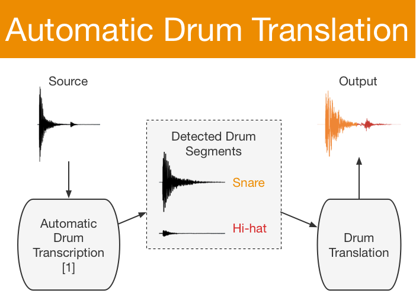

Poster available [here](./dafx19-poster.pdf) and paper [here](http://dafx2019.bcu.ac.uk/papers/DAFx2019_paper_25.pdf).

Audio examples include:

* 6 transformations created with the proposed automatic drum translation system
* 20 transformation pairs used in rhythmic evaluation of the system (Sections 3.2 and 4.1 in the <a href="http://dafx2019.bcu.ac.uk/papers/DAFx2019_paper_25.pdf">paper</a>)

<h3>Audio Examples</h3>

<figure>
    <figcaption>Automatic drum translation 1/6</figcaption>
	<figcaption>Source recording (left) and translation output (right)</figcaption>
    <audio controls
        src="./DAFx19_audio/adt-dt/src/src1.wav">
    </audio>
	<audio controls
		src="./DAFx19_audio/adt-dt/redrummings/redrumming1.wav">
	</audio>
</figure>

<figure>
    <figcaption>Automatic drum translation 2/6</figcaption>
	<figcaption>Source recording (left) and translation output (right)</figcaption>
    <audio controls
        src="./DAFx19_audio/adt-dt/src/src2.wav">
    </audio>
	<audio controls
		src="./DAFx19_audio/adt-dt/redrummings/redrumming2.wav">
	</audio>
</figure>

<figure>
    <figcaption>Automatic drum translation 3/6</figcaption>
	<figcaption>Source recording (left) and translation output (right)</figcaption>
    <audio controls
        src="./DAFx19_audio/adt-dt/src/src3.wav">
    </audio>
	<audio controls
		src="./DAFx19_audio/adt-dt/redrummings/redrumming3.wav">
	</audio>
</figure>

<figure>
    <figcaption>Automatic drum translation 4/6</figcaption>
	<figcaption>Source recording (left) and translation output (right)</figcaption>
    <audio controls
        src="./DAFx19_audio/adt-dt/src/src4.wav">
    </audio>
	<audio controls
		src="./DAFx19_audio/adt-dt/redrummings/redrumming4.wav">
	</audio>
</figure>

<figure>
    <figcaption>Automatic drum translation 5/6</figcaption>
	<figcaption>Source recording (left) and translation output (right)</figcaption>
    <audio controls
        src="./DAFx19_audio/adt-dt/src/src5.wav">
    </audio>
	<audio controls
		src="./DAFx19_audio/adt-dt/redrummings/redrumming5.wav">
	</audio>
</figure>

<figure>
    <figcaption>Automatic drum translation 6/6</figcaption>
	<figcaption>Source recording (left) and translation output (right)</figcaption>
    <audio controls
        src="./DAFx19_audio/adt-dt/src/src6.wav">
    </audio>
	<audio controls
		src="./DAFx19_audio/adt-dt/redrummings/redrumming6.wav">
	</audio>
</figure>

---

<figure>
    <figcaption>Drum Translation 1/20</figcaption>
	<figcaption>Source recording (left) and translation output (right)</figcaption>
    <audio controls
        src="./DAFx19_audio/input/source16.wav">
    </audio>
	<audio controls
		src="./DAFx19_audio/output/translation16.wav">
	</audio>
</figure>

<figure>
    <figcaption>Drum Translation 2/20</figcaption>
	<figcaption>Source recording (left) and translation output (right)</figcaption>
	<audio controls
        src="./DAFx19_audio/input/source19.wav">
    </audio>
	<audio controls
		src="./DAFx19_audio/output/translation19.wav">
	</audio>
</figure>

<figure>
    <figcaption>Drum Translation 3/20</figcaption>
	<figcaption>Source recording (left) and translation output (right)</figcaption>
	<audio controls
        src="./DAFx19_audio/input/source15.wav">
    </audio>
	<audio controls
		src="./DAFx19_audio/output/translation15.wav">
	</audio>
</figure>

<figure>
    <figcaption>Drum Translation 4/20</figcaption>
	<figcaption>Source recording (left) and translation output (right)</figcaption>
	<audio controls
        src="./DAFx19_audio/input/source18.wav">
    </audio>
	<audio controls
		src="./DAFx19_audio/output/translation18.wav">
	</audio>
</figure>

<figure>
    <figcaption>Drum Translation 5/20</figcaption>
	<figcaption>Source recording (left) and translation output (right)</figcaption>
	<audio controls
        src="./DAFx19_audio/input/source14.wav">
    </audio>
	<audio controls
		src="./DAFx19_audio/output/translation14.wav">
	</audio>
</figure>

<figure>
    <figcaption>Drum Translation 6/20</figcaption>
	<figcaption>Source recording (left) and translation output (right)</figcaption>
	<audio controls
        src="./DAFx19_audio/input/source13.wav">
    </audio>
	<audio controls
		src="./DAFx19_audio/output/translation13.wav">
	</audio>
</figure>

<figure>
    <figcaption>Drum Translation 7/20</figcaption>
	<figcaption>Source recording (left) and translation output (right)</figcaption>
	<audio controls
        src="./DAFx19_audio/input/source10.wav">
    </audio>
	<audio controls
		src="./DAFx19_audio/output/translation10.wav">
	</audio>
</figure>

<figure>
    <figcaption>Drum Translation 8/20</figcaption>
	<figcaption>Source recording (left) and translation output (right)</figcaption>
	<audio controls
        src="./DAFx19_audio/input/source1.wav">
    </audio>
	<audio controls
		src="./DAFx19_audio/output/translation1.wav">
	</audio>
</figure>

<figure>
    <figcaption>Drum Translation 9/20</figcaption>
	<figcaption>Source recording (left) and translation output (right)</figcaption>
	<audio controls
        src="./DAFx19_audio/input/source11.wav">
    </audio>
	<audio controls
		src="./DAFx19_audio/output/translation11.wav">
	</audio>
</figure>

<figure>
    <figcaption>Drum Translation 10/20</figcaption>
	<figcaption>Source recording (left) and translation output (right)</figcaption>
	<audio controls
        src="./DAFx19_audio/input/source12.wav">
    </audio>
	<audio controls
		src="./DAFx19_audio/output/translation12.wav">
	</audio>
</figure>

<figure>
    <figcaption>Drum Translation 11/20</figcaption>
	<figcaption>Source recording (left) and translation output (right)</figcaption>
	<audio controls
        src="./DAFx19_audio/input/source17.wav">
    </audio>
	<audio controls
		src="./DAFx19_audio/output/translation17.wav">
	</audio>
</figure>

<figure>
    <figcaption>Drum Translation 12/20</figcaption>
	<figcaption>Source recording (left) and translation output (right)</figcaption>
	<audio controls
        src="./DAFx19_audio/input/source2.wav">
    </audio>
	<audio controls
		src="./DAFx19_audio/output/translation2.wav">
	</audio>
</figure>

<figure>
    <figcaption>Drum Translation 13/20</figcaption>
	<figcaption>Source recording (left) and translation output (right)</figcaption>
	<audio controls
        src="./DAFx19_audio/input/source20.wav">
    </audio>
	<audio controls
		src="./DAFx19_audio/output/translation20.wav">
	</audio>
</figure>

<figure>
    <figcaption>Drum Translation 14/20</figcaption>
	<figcaption>Source recording (left) and translation output (right)</figcaption>
	<audio controls
        src="./DAFx19_audio/input/source3.wav">
    </audio>
	<audio controls
		src="./DAFx19_audio/output/translation3.wav">
	</audio>
</figure>

<figure>
    <figcaption>Drum Translation 15/20</figcaption>
	<figcaption>Source recording (left) and translation output (right)</figcaption>
	<audio controls
        src="./DAFx19_audio/input/source4.wav">
    </audio>
	<audio controls
		src="./DAFx19_audio/output/translation4.wav">
	</audio>
</figure>

<figure>
    <figcaption>Drum Translation 16/20</figcaption>
	<figcaption>Source recording (left) and translation output (right)</figcaption>
	<audio controls
        src="./DAFx19_audio/input/source5.wav">
    </audio>
	<audio controls
		src="./DAFx19_audio/output/translation5.wav">
	</audio>
</figure>

<figure>
    <figcaption>Drum Translation 17/20</figcaption>
	<figcaption>Source recording (left) and translation output (right)</figcaption>
	<audio controls
        src="./DAFx19_audio/input/source6.wav">
    </audio>
	<audio controls
		src="./DAFx19_audio/output/translation6.wav">
	</audio>
</figure>

<figure>
    <figcaption>Drum Translation 18/20</figcaption>
	<figcaption>Source recording (left) and translation output (right)</figcaption>
	<audio controls
        src="./DAFx19_audio/input/source7.wav">
    </audio>
	<audio controls
		src="./DAFx19_audio/output/translation7.wav">
	</audio>
</figure>

<figure>
    <figcaption>Drum Translation 19/20</figcaption>
	<figcaption>Source recording (left) and translation output (right)</figcaption>
	<audio controls
        src="./DAFx19_audio/input/source8.wav">
    </audio>
	<audio controls
		src="./DAFx19_audio/output/translation8.wav">
	</audio>
</figure>

<figure>
    <figcaption>Drum Translation 20/20</figcaption>
	<figcaption>Source recording (left) and translation output (right)</figcaption>
	<audio controls
        src="./DAFx19_audio/input/source9.wav">
    </audio>
	<audio controls
		src="./DAFx19_audio/output/translation9.wav">
	</audio>
</figure>

<h3></h3>
<strong>References:</strong>

[1] Carl Southall, Ryan Stables, and Jason Hockman, “Automatic drum transcription using bi-directional recurrent neural networks,” in Proceedings of the International Society of Music Information Retrieval Conference, pp. 591–597, 2016, Available at: <a href="https://github.com/CarlSouthall/ADTLib">https://github.com/CarlSouthall/ADTLib/</a>.
